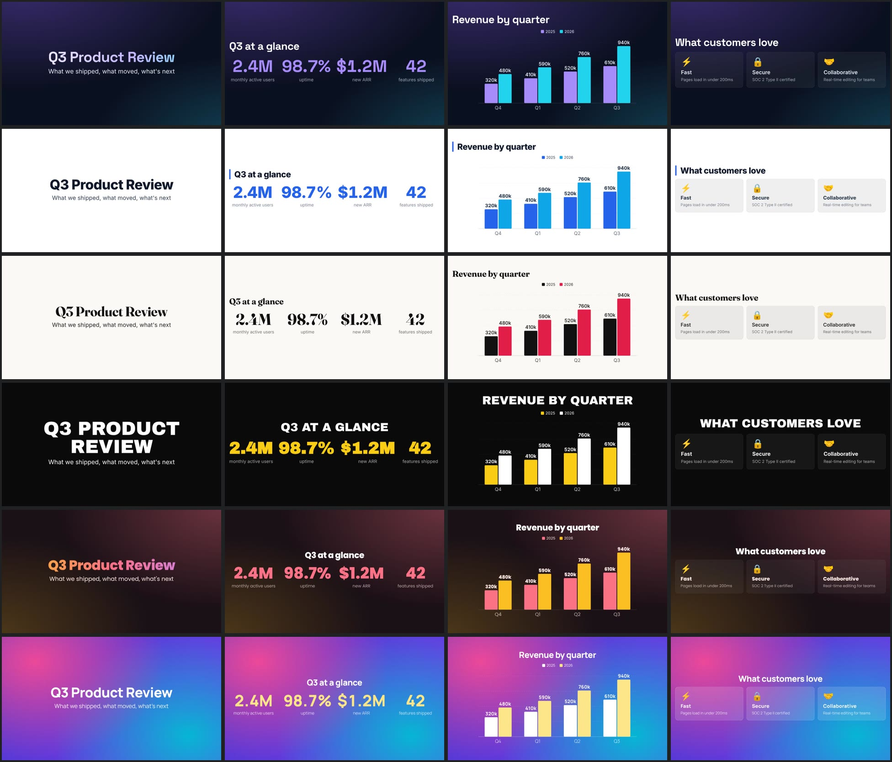

# reveal-mcp

An MCP server that lets Claude (Claude Code, Claude Desktop) and OpenAI Codex build **designed, animated reveal.js presentations** and export them as HTML, PDF or video.

What it adds on top of an AI writing HTML by hand:

- **🎨 Design presets.** Six complete looks (`aurora`, `corporate`, `minimal`, `bold`, `sunset`, `glass`) with fonts, colors, backgrounds and motion picked to work together. The AI names one; it never writes CSS.
- **🧩 Data-driven components.** The AI sends data, the server draws a polished, animated slide: **stats** that count up, **charts** (bar, horizontal bar, line, donut) that grow and draw, **timeline**, **cards**, **comparison**, **steps**, **quote**, and **diagrams** (Mermaid).
- **🎬 Video export.** Records the deck playing, with every transition and animation, to **MP4, WebM or GIF** (1080p, 720p, square or vertical).
- **👀 Built-in quality checks.** Every edit reports layout problems (text running off the slide, cut-off code, broken images, empty slides) as a few words of text, and `screenshot_slides` lets the AI see the slides when it needs to.
- **💸 Low token cost.** Tool definitions are about 2,000 tokens (down from ~10,000 in 0.2), checks are text by default, and components replace pages of HTML with a few lines of JSON.
- **📦 Portable output.** One offline HTML file with everything inlined, or a PDF. Decks are saved, so "change slide 4" only touches slide 4.

```
You: "Make a 10-slide deck on our Q3 results, corporate style, then a video"
Claude → create_presentation(preset: "corporate", slides: [...])  → .../q3-results-3f9a1c.html  layoutIssues: slide 6 overflows
       → update_slide(slide: "6", ...)                             → layoutIssues: none
       → export_presentation(format: "mp4")                        → .../q3-results-3f9a1c.mp4
```

## Install

Requires Node.js 18+. Screenshots, PDF and video use the Chrome, Chromium, Edge or Brave already on your machine (no browser is downloaded). Video also needs ffmpeg, which is installed automatically through the optional `ffmpeg-static` dependency. If that download is blocked, install ffmpeg yourself or point `REVEAL_MCP_FFMPEG` at it.

Until the package is published to npm, build it from source:

```bash
git clone <this repo> reveal-mcp && cd reveal-mcp
npm install          # also builds dist/
npm link             # optional: puts `reveal-mcp` on your PATH
```

Then use `node /absolute/path/to/reveal-mcp/dist/index.js` as the command in the configs below (or `reveal-mcp` if you ran `npm link`). Once published, `npx -y reveal-mcp` works everywhere.

### Claude Code

```bash
claude mcp add reveal -- npx -y reveal-mcp
# from source:
claude mcp add reveal -- node /absolute/path/to/reveal-mcp/dist/index.js
```

Add `--scope user` to make it available in every project.

### Claude Desktop

Settings → Developer → Edit Config (`claude_desktop_config.json`):

```json
{
  "mcpServers": {
    "reveal": {
      "command": "npx",
      "args": ["-y", "reveal-mcp"]
    }
  }
}
```

Restart Claude Desktop. On Windows use `"command": "npx.cmd"` if `npx` is not found.

### OpenAI Codex (CLI and IDE extension)

```bash
codex mcp add reveal -- npx -y reveal-mcp
```

or edit `~/.codex/config.toml`:

```toml
[mcp_servers.reveal]
command = "npx"
args = ["-y", "reveal-mcp"]
startup_timeout_sec = 60   # first npx run downloads the package
tool_timeout_sec = 600     # video export records in real time
```

### Any other MCP client

It is a standard stdio server: `npx -y reveal-mcp`. Inspect it with `npm run inspect`.

## Tools

| Tool | What it does |
| --- | --- |
| `create_presentation` | Title, optional `preset`, all slides and optional `settings` in one call. Writes the HTML and returns its path plus `layoutIssues`. |
| `add_slides` | Insert slides (default: at the end). |
| `update_slide` | Merge fields into slide `"3"` (or vertical slide `"3.1"`); `null` removes a field; `replace: true` replaces it. |
| `remove_slide` / `move_slide` | Prune and reorder. |
| `update_settings` | Merge deck settings (preset, theme, motion, brand, transition, size, custom CSS/JS…) or rename. |
| `get_presentation` | Compact outline by default; one slide or the full deck on request. |
| `screenshot_slides` | Slides as images in their final state plus layout checks. `images`: `sheet` (one overview image, default), `each`, or `none`. Images are also saved next to the deck. |
| `export_presentation` | `html`, `pdf`, `mp4`, `webm` or `gif`. Video options: `resolution`, `slideDuration`, `fragmentDuration`; reports progress while recording. |
| `preview_presentation` | Local `http://127.0.0.1:<port>/<id>` URL that always renders the latest version. |
| `list_presentations` / `delete_presentation` | Manage saved decks. |
| `get_authoring_guide` | Full reference the AI reads once (also resource `reveal://guide`). |

There is also a `make_presentation` prompt (topic, audience, slides, style).

## Presets



| Preset | Look | Motion |
| --- | --- | --- |
| `aurora` | Dark tech, violet/cyan glow, Space Grotesk | subtle |
| `corporate` | Clean light business, navy and blue, Inter | subtle |
| `minimal` | Editorial off-white, Fraunces serif headings | subtle |
| `bold` | Black and yellow, huge Archivo Black type | lively |
| `sunset` | Warm dark with coral/amber glow, Poppins | lively |
| `glass` | Vivid gradient with frosted cards, Manrope | subtle |

Brand it with `settings.brand`: `{ primary, logo, logoPosition, font, headingFont }` (any Google Font).

## Components

```jsonc
{ "title": "Q3 at a glance", "component": { "type": "stats", "items": [
    { "value": "2.4M", "label": "monthly active users" }, { "value": "98.7%", "label": "uptime" } ] } }

{ "title": "Revenue", "component": { "type": "chart", "kind": "bar", "labels": ["Q1","Q2","Q3"],
    "series": [ { "name": "2025", "values": [410, 520, 610] }, { "name": "2026", "values": [590, 760, 940] } ], "unit": "k" } }

{ "title": "Release pipeline", "component": { "type": "diagram", "code": "flowchart LR\n A[Commit] --> B[CI] --> C[Deploy]" } }
```

| Type | Data |
| --- | --- |
| `stats` | `items: [{ value, label, prefix?, suffix? }]`; numbers count up |
| `chart` | `kind: bar \| hbar \| line \| donut`, `labels`, `series: [{ name?, values }]`, `unit?`, `max?` |
| `timeline` | `items: [{ date, title, text? }]` |
| `cards` | `items: [{ icon?, title, text? }]`, `columns?` |
| `comparison` | `left` / `right`: `{ title, items }` |
| `steps` | `items: [{ title, text? }]` |
| `quote` | `text`, `author?`, `role?` |
| `diagram` | `code`: Mermaid source |

`stepByStep: true` (timeline, cards, comparison, steps) reveals items one click at a time, and one step at a time in video.

See [`examples/components.json`](examples/components.json) for a full deck using every component.

## What a slide can contain

```jsonc
{
  "title": "Agenda",
  "subtitle": "optional",
  "content": "- Markdown **or** HTML\n- ```js [1|2-3]``` fences step through lines",
  "format": "markdown",                    // or "html"
  "layout": "default",                     // title | section | center | columns | image-left | image-right | fullscreen
  "columns": ["### Left", "### Right"],    // with layout "columns"
  "image": "/abs/path/or/url.png",         // with image-left / image-right (local files are embedded)
  "code": { "code": "...", "language": "ts", "lineNumbers": "|1-3|5", "dataId": "snippet" },
  "fragments": [{ "content": "Revealed later", "effect": "highlight-red", "index": 2 }],
  "listFragments": "fade-up",              // reveal every bullet one by one
  "notes": "Speaker notes (press S)",
  "background": { "gradient": "linear-gradient(135deg,#667eea,#764ba2)" }, // color | image | video | iframe, opacity, size
  "transition": "zoom",                    // none fade slide convex concave zoom (+ transitionIn/Out, transitionSpeed)
  "autoAnimate": true,                     // morph matching elements into the next/previous auto-animate slide
  "autoSlide": 3000,
  "duration": 5000,                        // video export: ms this slide stays on screen
  "component": { "type": "stats", "items": [] },
  "className": "anim-fade-up",
  "verticalSlides": [{ "title": "Drill-down" }]
}
```

### Motion toolbox

- **Transitions**: deck-wide `transition` or per slide; split with `transitionIn`/`transitionOut`.
- **Fragments**: 19 reveal.js effects (`fade-up`, `grow`, `strike`, `highlight-current-blue`, ...).
- **Auto-animate**: consecutive `autoAnimate` slides tween position, size, color, radius, font size; match by text or `data-id`. Code blocks with the same `dataId` morph line by line.
- **Motion classes** (added by reveal-mcp, play whenever the slide appears): `anim-fade-up/down/left/right`, `anim-zoom-in/out`, `anim-flip-in`, `anim-blur-in`, `anim-bounce-in`, `anim-shake`, `anim-float`, `anim-pulse`, `anim-spin`, `anim-gradient-text`, `anim-typewriter`, `anim-stagger`. Tune with `style="--delay:.3s; --duration:1s"`. They are disabled in PDF export and for users with reduced-motion enabled.
- **Automatic entrance motion**: `settings.motion` = `subtle` or `lively` animates every slide's heading and content in (presets turn it on).
- **Escape hatches**: `customCss` (your own keyframes, fonts, `--r-*` theme variables), `headHtml` + `customJs` (e.g. load GSAP and hook `Reveal.on('slidechanged', ...)`).

See [`examples/showcase.json`](examples/showcase.json) for a deck that uses most of these; pass it straight to `create_presentation`.

Themes: black, white, league, beige, sky, night, serif, simple, solarized, blood, moon, dracula, black-contrast, white-contrast.

## Configuration

| Env var | Default | Purpose |
| --- | --- | --- |
| `REVEAL_MCP_HOME` | `~/reveal-mcp` | Where decks (`decks/*.json`) and exports (`presentations/`) live |
| `REVEAL_MCP_CHROME` | auto-detect | Browser used for screenshots, PDF and video (`CHROME_PATH` also works) |
| `REVEAL_MCP_FFMPEG` | auto-detect | ffmpeg used for video (`ffmpeg-static`, then `ffmpeg` on PATH) |
| `REVEAL_MCP_PREVIEW_PORT` | random | Fixed port for `preview_presentation` |
| `REVEAL_MCP_AUTOCHECK` | `1` | Set `0` to skip the automatic layout check after each edit (it takes 1-3 s) |
| `REVEAL_MCP_MERMAID` | CDN | Path to a local `mermaid.min.js` to inline, so diagrams work offline |

Pass env vars through your client config, for example in Codex:

```toml
[mcp_servers.reveal.env]
REVEAL_MCP_HOME = "/Users/me/Documents/Decks"
```

## Notes

- Exported HTML inlines reveal.js, its theme and plugins, so it opens offline. Web fonts (Google Fonts), KaTeX for math and Mermaid for diagrams load from the internet when available; fonts fall back to system fonts.
- Video is recorded in real time: a 10-slide deck takes about as long to export as it takes to play, plus a few seconds of encoding. Smoothness depends on the machine. If your app times out on long videos, raise its MCP tool timeout (Codex: `tool_timeout_sec`; Claude Code: the `MCP_TOOL_TIMEOUT` environment variable, in ms).
- `customJs` and `headHtml` are written into your own HTML file as-is; only use content you trust.

## Development

```bash
npm install
npm run build
npm test          # end-to-end over stdio: every tool, screenshots, PDF and video (SKIP_PDF=1 / SKIP_VIDEO=1 to skip)
npm run inspect   # MCP Inspector
```

## License

MIT. reveal.js is MIT licensed by Hakim El Hattab.
